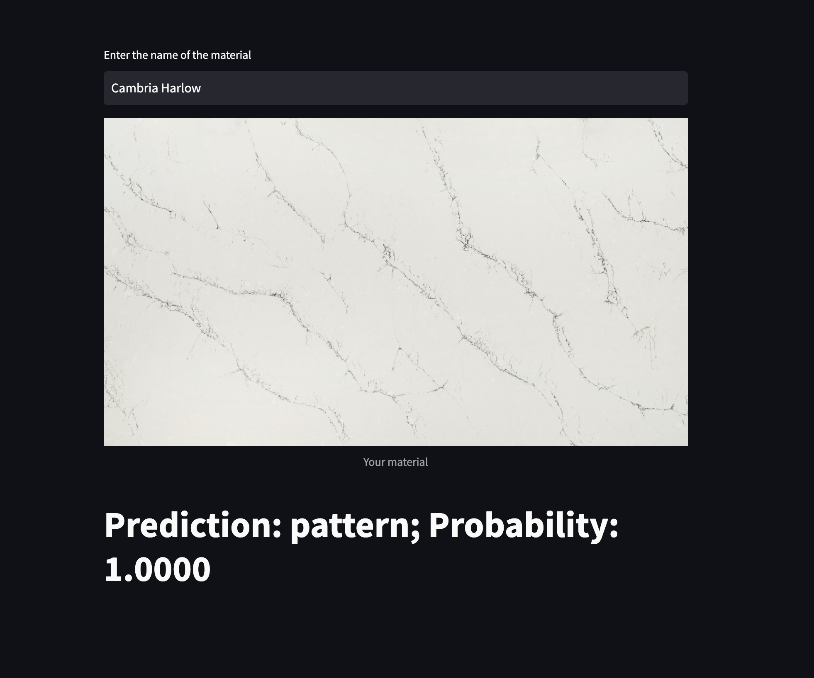
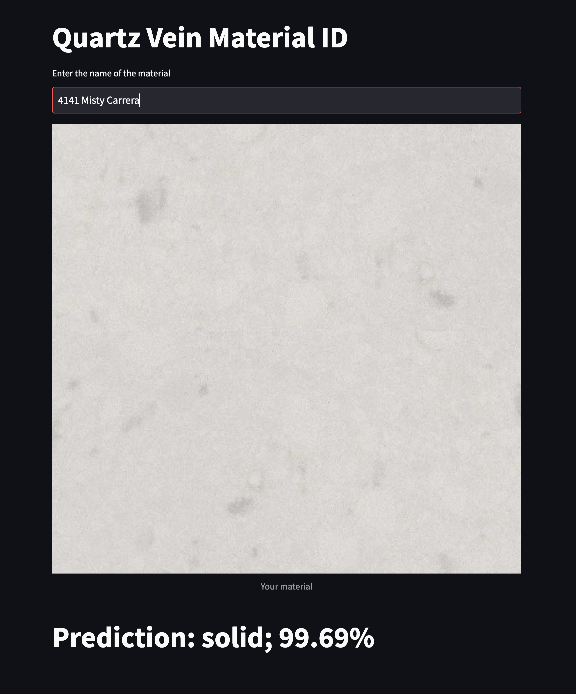

# Natural and Engineered Stone Vein Detector

A seamless look is key in countertop fabrication. The process begins before the project has started. Projects with "veined" material need to be estimated in a certain way to allow for that seamless look. 

This repo contains a simple image classification model trained to ID veined/bold pattered stone(quartz, porcelian, marble). Working on integrating the model into a function in excel or sheets. At the moment you can try it out [here](https://tadrossalama-materials-app-450dpc.streamlit.app/)
Pattern             |  Solid
:-------------------------:|:-------------------------:
  |  
